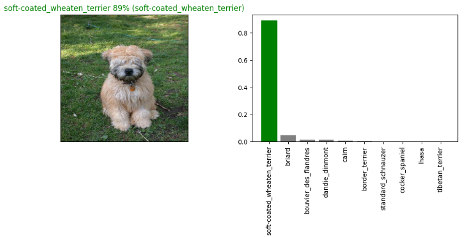

# 🐶 Dog Vision: Dog Breed Classification

This project is a deep learning-based image classifier that identifies dog breeds from images using TensorFlow and TensorFlow Hub.

## 📌 Overview

Using a Convolutional Neural Network (CNN) and transfer learning from a pretrained model, this app can predict the breed of a dog from a given image.

The model is trained on a labeled dataset of dog images, processed with image augmentation and optimized using TensorFlow best practices.

## 🧠 Features

- 🔍 Predicts the **breed** of a dog from a PNG image
- 📊 Shows **prediction confidence** and top 10 probable breeds
- 🧠 Built with **TensorFlow**, **TensorFlow Hub**, and **Keras**

## 🛠️ Tech Stack

- Python
- TensorFlow / Keras
- TensorFlow Hub
- NumPy & Matplotlib
- Google Colab / Jupyter

## 📁 Directory Structure

```
dog-vision/
├── dog_vision.ipynb               # Main notebook: training and evaluation
├── model/model_full.h5            # Final trained model
├── requirements.txt               # Dependencies for deployment
├── output/img.png                 # Results file
└── README.md                      # This file
```

## 🚀 How to Use

## 📸 Upload a Dog Image

- Upload a PNG image.
- Wait for the prediction.
- Get the predicted breed with confidence!

## 🔬 Model Training

The model is based on a pre-trained feature extractor from TensorFlow Hub, fine-tuned on your dataset. Training includes:

- Train-validation split
- Batch preparation
- Early stopping
- Full-dataset retraining
- Model saved as `model_full.h5`

## 🧪 Evaluation

The notebook includes:

- Accuracy metrics
- Loss curves
- Sample prediction visualizations
- Top-10 class confidence bar charts
  

## 🐾 Sample Output



<predicted_output> <prediction_accuracy> (<actual_output>)

## 👨‍💻 Author

Made with ❤️ by @sk8011
